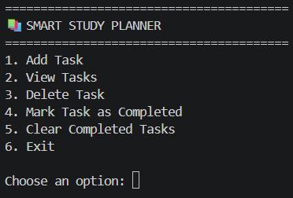
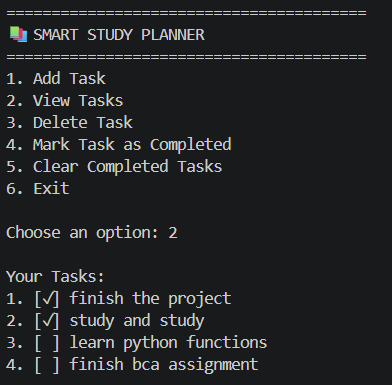

# 📚 Smart Study Planner

A simple command-line Study Planner built with Python.

This project helps users manage their study tasks by allowing them to add, view, complete, delete, and save tasks permanently using JSON.

---

## ✨ Features

- ➕ Add new study tasks
- 👀 View all tasks
- ✅ Mark tasks as completed
- 🗑 Delete tasks
- 🧹 Clear all completed tasks
- 💾 Automatically save tasks
- 📂 Automatically load tasks on startup

---

## 🛠 Technologies Used

- Python 3
- JSON
- File Handling

---

## 🚀 How to Run

1. Clone this repository

```bash
git clone https://github.com/suhanachoudhary1414-cloud/smart-study-planner.git
```

2. Open the project folder

3. Run

```bash
py study_planner.py
```

---

## 📂 Project Structure

```
smart-study-planner/
│
├── images/
│   ├── menu.png
│   └── tasks.png
│
├── study_planner.py
├── tasks.json
└── README.md
```

---

## 🔮 Future Improvements

- Edit existing tasks
- Add due dates
- Task priorities
- Categories
- Search tasks
- GUI version using Tkinter

---

## 📷 Screenshots

### Main Menu



### Task Management



## 👩‍💻 Author

Suhana Choudhary